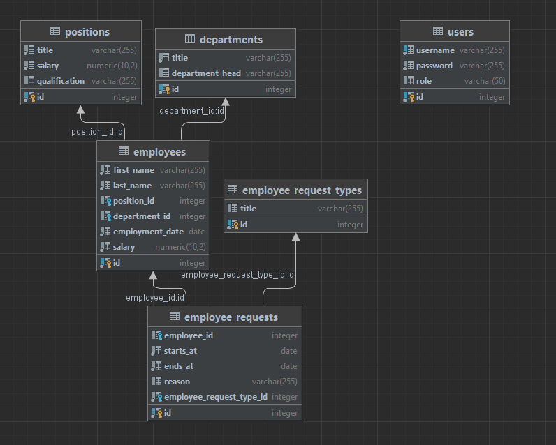

# goHR
HRMS - human resource management system. Проект на языке Go для эффективного управления персоналом.

## Стек технологий
- Golang
- Gin
- PGX PostgreSQL
- JWT (JSON Web Token) 
- Lumberjack.v2

## Логирование
* В системы реализованы 4 уровня логов:
1. Debug
2. Errors
3. Info
4. Warning

## Возможности
- Создание, получение, модификация и удаление списка пользователей.
- Создание, получение, модификация и удаление списка сотрудников.
- Создание, получение, модификация и удаление списка отделов, в которых работают сотрудники.
- Создание, получение, модификация и удаление списка позиций (должностей).
- Создание, получение, модификация и удаление списка запросов на больничный и отпуск.
- Поиск сотрудника по имени.

## Диаграмма таблиц
